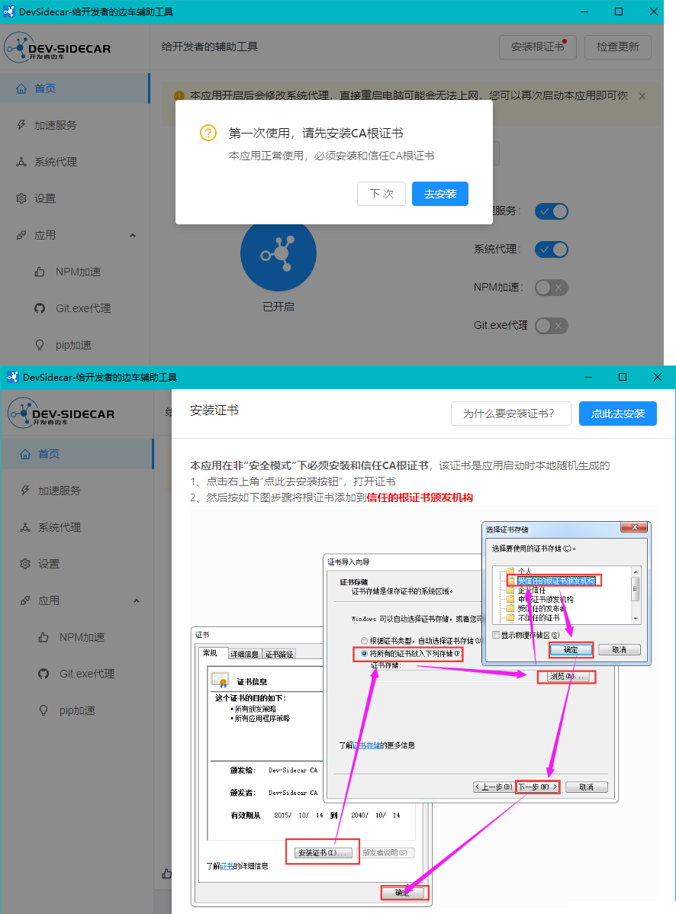
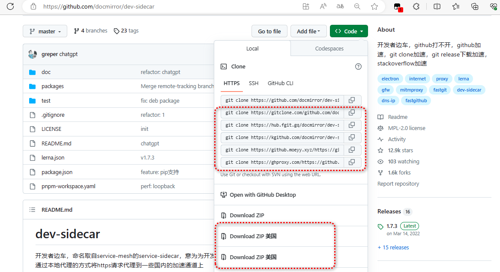
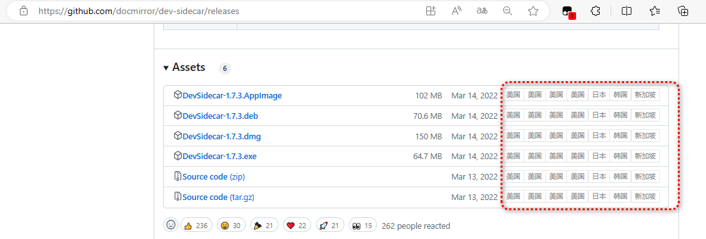
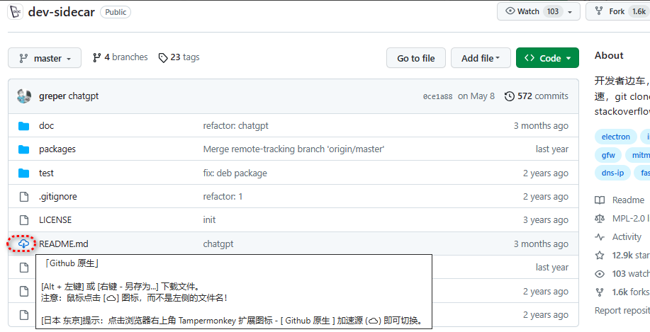
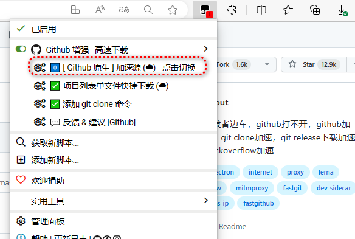

# github加速器

参考:https://deepmind.t-salon.cc/article/8358

### 推荐1：FastGithub

FastGithub是一款Github加速神器，解决github打不开、用户头像无法加载、releases无法上传下载、git-clone、git-pull、git-push失败等问题。
它支持多种平台：Windows、Linux、MacOS、Docker等

：https://github.com/search?q=FastGithub

### 推荐2：dev-sidecar

开发者边车，命名取自service-mesh的service-sidecar，意为为开发者打辅助的边车工具（以下简称ds）。通过本地代理的方式将https请求代理到一些国内的加速通道上

：https://github.com/docmirror/dev-sidecar

如果此时Github访问不了，可以到 [docmirror/dev-sidecar | Gitcode](https://gitcode.net/mirrors/docmirror/dev-sidecar/-/releases) 下载，这是 dev-sidecar 的作者在Gitcode维护的项目，目前与Github里的保持同步，安装部署请参考 [README.md](https://gitcode.net/mirrors/docmirror/dev-sidecar/-/blob/master/README.md)

首次打开，需要安装`CA根证书`，点击`去安装`，然后按提示一步步操作去完成安装



证书安装完成，即可愉快的[访问 Github](https://so.csdn.net/so/search?q=访问 Github&spm=1001.2101.3001.7020) 了。另外，还支持`npm`、`git`、`pip`加速。

### 推荐3：Watt Toolkit

Watt Toolkit（原名Steam++）是一个开源跨平台的多功能 Steam 工具箱。

官网地址：https://steampp.net/

Github地址：https://github.com/BeyondDimension/SteamTools

_官网下载也是引导到其他渠道进行下载，不过官网下载有个好处，它会检测你系统和CPU架构，然后推荐你下载哪个版本。_下载安装后，打开应用程序，在`网络加速`界面，勾选`Github`，然后点击`一键加速`

### 推荐4：篡改猴插件 + 用户脚本

下载安装–>篡改猴 Tampermonkey 插件

> 篡改猴 (
>
> ```
> Tampermonkey
> ```
>
> ) 是拥有 超过 1000 万用户 的最流行的浏览器扩展之一。
>
> 它允许用户自定义并增强您最喜爱的网页的功能。用户脚本是小型 JavaScript 程序，可用于向网页添加新功能或修改现有功能。使用 篡改猴，您可以轻松在任何网站上创建、管理和运行这些用户脚本。它适用于 Chrome、Microsoft Edge、Safari、Opera Next 和 Firefox 等多种浏览器。
>
> 
>
> Tampermonkey 官网地址：https://www.tampermonkey.net/index.php
>
> 在官网首页，找到其在应用商店的对应下载入口（你也可以直接到插件应用商店直接搜索）
>
> *另外还有一些其他比较优秀的浏览器插件管理工具，如：https://violentmonkey.github.io/*

下载安装–>Github 增强 - 高速下载 用户脚本

【Github 增强 - 高速下载】脚本只是将加速后的文件下载地址添加到了网页，省去了手动获取的麻烦，方便直接点击高速下载！它并不能解决无法访问Github的问题！！！因此如果你无法访问GitHub官网，可结合前面的来使用

用户脚本是一段代码，它们能够优化您的网页浏览体验。安装之后，有些脚本能为网站添加新的功能，有些能使网站的界面更加易用，有些则能隐藏网站上烦人的部分内容。

有几个不错的用户脚本管理网站：

- [userscript.zone 搜索](https://www.userscript.zone/)
- [Greasy Fork 油叉](https://greasyfork.org/)
- [OpenUserJS](https://openuserjs.org/)
- [Github Gist 中搜索](https://gist.github.com/search?l=JavaScript&o=desc&q="%3D%3DUserScript%3D%3D"&s=updated)

通过 Greasy Fork，搜索 **Github 增强**，在源码页面，点击安装，然后等待安装完成。可在工具栏点击【扩展】图标-【篡改猴】-【管理面板】打开管理面板

Github Clone 下的 HTTPS、SSH、Download ZIP 这些下载地方多了一些加速下载入口



在Releases的下载位置处，页多了一些加速下载入口



另外，还支持源码单文件下载，鼠标放到文件名左侧的图标，显示☁图标及提示信息，通过【Alt+鼠标左键】或者【鼠标右键+另存为…】来下载文件。



可以在【工具栏】-【篡改猴】-【Github 增强 - 高速下载】的菜单列表中，点击【XXX加速源-点击切换】来切换单文件下载的加速源，也可以点击【项目列表单文件快捷下载】关闭单文件下载加速功能。



**使用美国的加速源，使用前 100~200kb/s，使用美国加速源后，4~5MB/s（注意不一定所有的加速源都快，有的可能更慢或干脆不可用）**

另外该脚本的作者在Github上还有一些其他的脚本：https://github.com/XIU2/UserScript

### 推荐5：SwitchHosts + Hosts

SwitchHosts 是一个管理 hosts 文件的应用，支持 Windows、MacOS、Linux等平台；

Github：https://github.com/oldj/SwitchHosts

Hosts 这里是指Github的稳定的Hosts，这里推荐两个

- ：https://github.com/521xueweihan/GitHub520
- ：https://github.com/ineo6/hosts

这两个都能寻找最优IP并及时自动更新hosts

- 1）以管理员身份打开 SwitchHosts；
- 2）新建一个规则，类型选 Remote；
- 3）Hosts title 随便取，URL 填写 https://raw.hellogithub.com/hosts ，Auto refresh 选择1 hour，然后OK保存；
- 4）然后新建的规则开关打开，即可愉快的使用Github了

URL地址：

- https://github.com/521xueweihan/GitHub520/blob/main/hosts
- https://raw.hellogithub.com/hosts
- https://github.com/ineo6/hosts/blob/master/next-hosts
- https://gitlab.com/ineo6/hosts/-/raw/master/next-hosts

不建议使用Github的URL进行更新，因为可能你首次更新访问不同这个URL

大部分情况下是直接生效，如未生效可尝试下面的办法，刷新 DNS：

- Windows 命令：`ipconfig /flushdns`
- Linux 命令： `sudo /etc/init.d/nscd restart`
- Mac 命令：`sudo killall -HUP mDNSResponder`

### 总结

- 推荐1、2、3 经测试，效果都还可以；
- 推荐4 不是加速 github 官网本身，而是加速 clone、releases、源码包下载、项目单文件下载等，可以与推荐1、2、3、5 结合使用；
- 推荐5，测试发现，偶尔有不稳定的情况，但相对什么都不做要好些；
- 针对推荐4，有一个更好更牛逼的替代方案，就是使用迅雷进行下载。