 

主机是sunshine，客机是moonlight，一个太阳一个月光，两者真是太配啦！

**下载sunshine**  
sunshine是服务器端，去以下GitHub链接下载windows端的解压缩即用版

```
https://github.com/LizardByte/Sunshine/releases
```

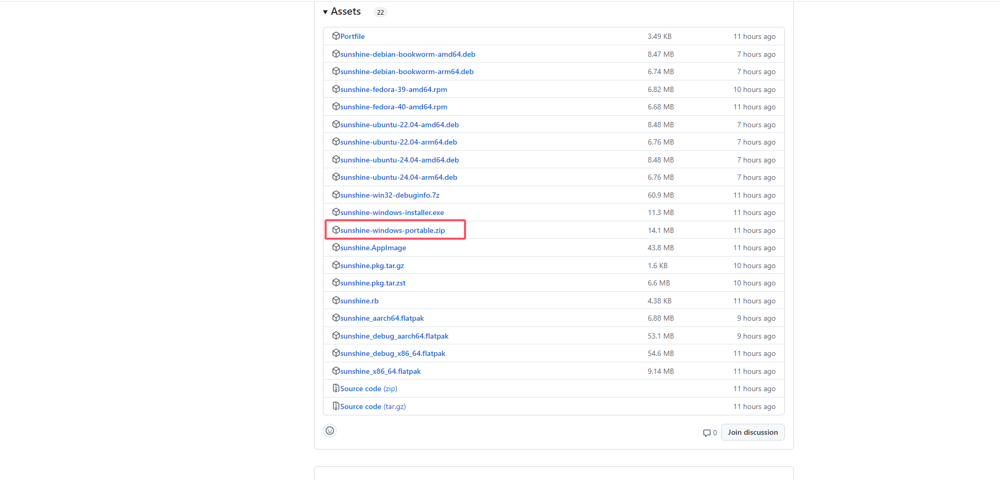  
下载完毕解压，点击exe文件启动sunshine  
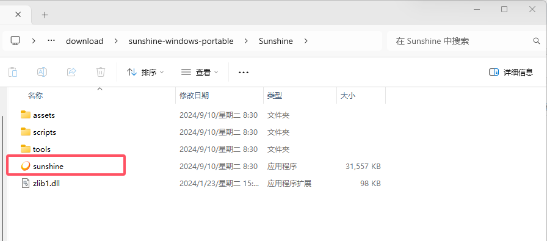  
启动后可以按住ctrl+鼠标左键点击这个链接从浏览器打开界面，也可以在浏览器中输入localhost:47990  
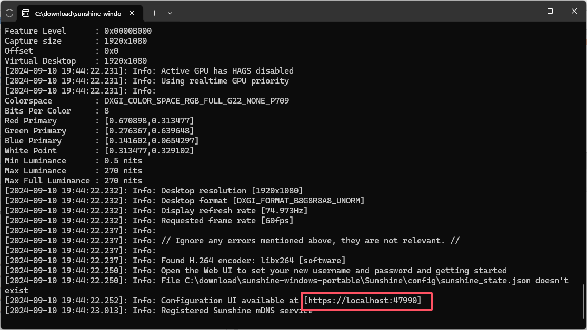  
然后访问到以下sunshine界面  
ps:如果浏览器提示链接不安全，点高级，然后继续访问  
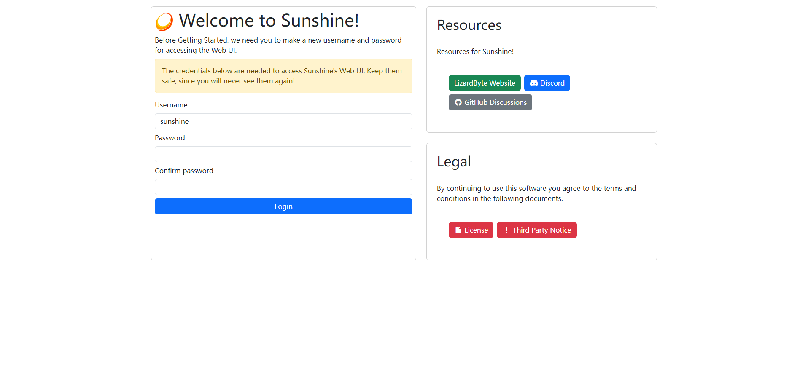  
在以上界面password中输入密码和confirm password中输入确认密码，比如都填123，然后等待页面自动跳转到以下页面  
  
**客户机下载moonlight**  
在以下GitHub链接下载，这里第二台电脑也是Windows，就下载Windows版的了

```
https://github.com/moonlight-stream/moonlight-qt/releases
```

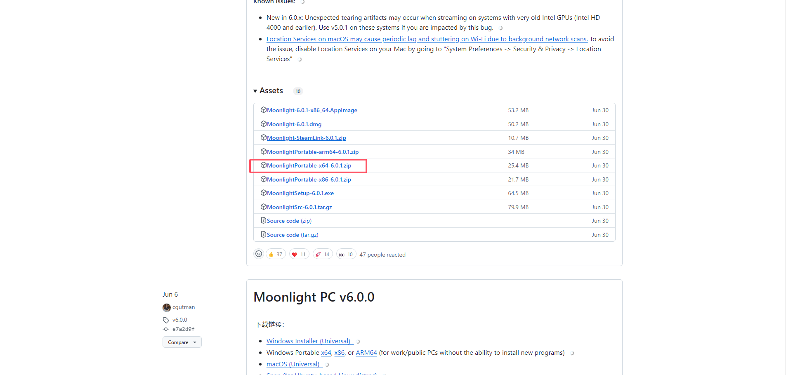  
下载完毕解压，启动此exe文件启动moonlight  
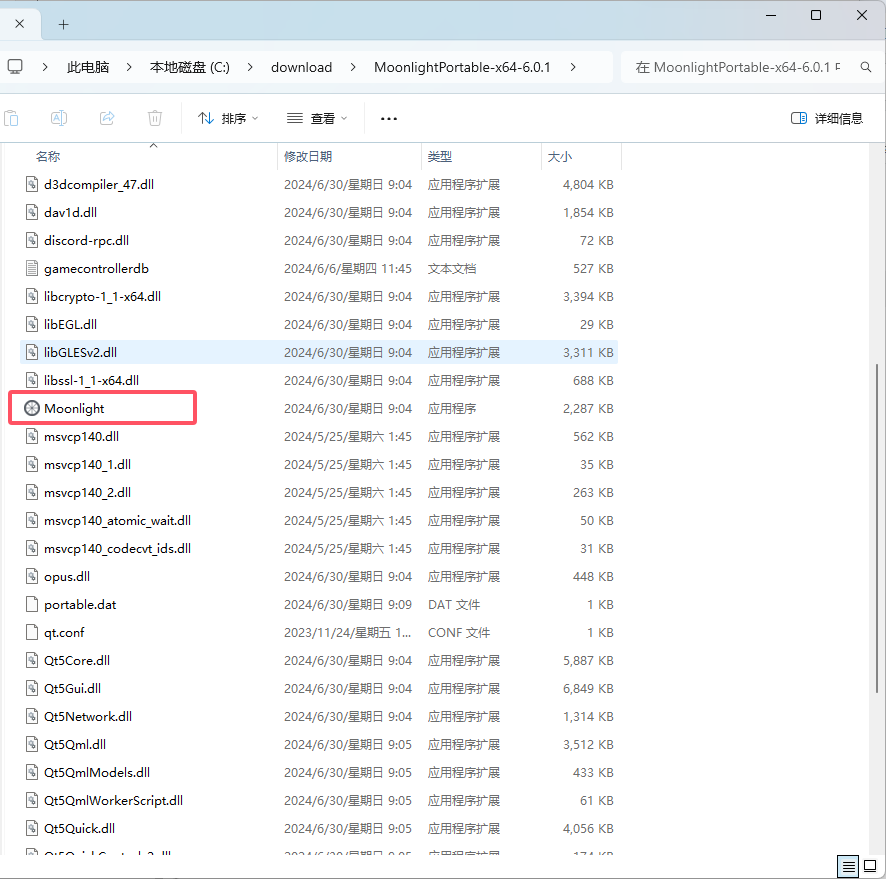  
启动后如图所示，如果没有自动识别到可以连接的主机，在右上角点击添加主机  
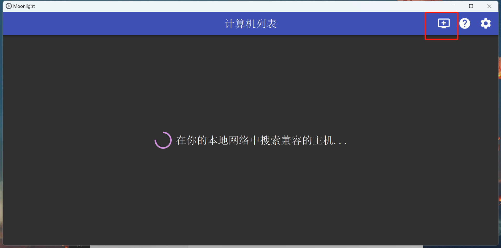  
在sunshine启动的主机终端中输入ipconfg查询当前ip地址  
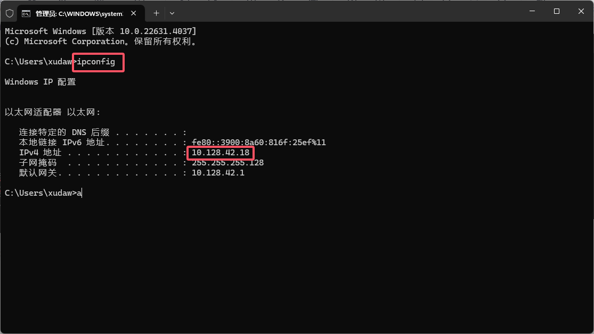  
在客户机moonlight中填入此ip地址点击确定  
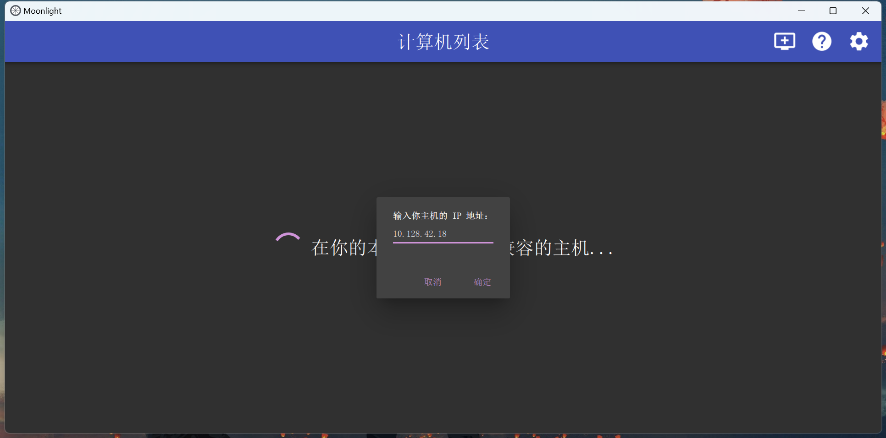  
在moonlight中添加到sunshine主机  
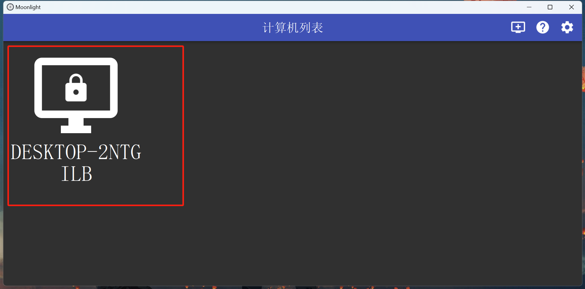  
弹出配对码  
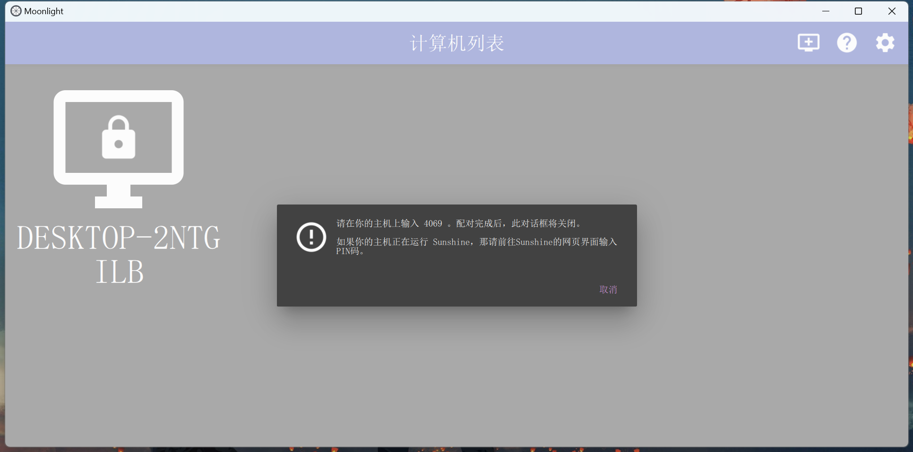  
在sunshine主机浏览器界面左上角点击pin打开配对界面  
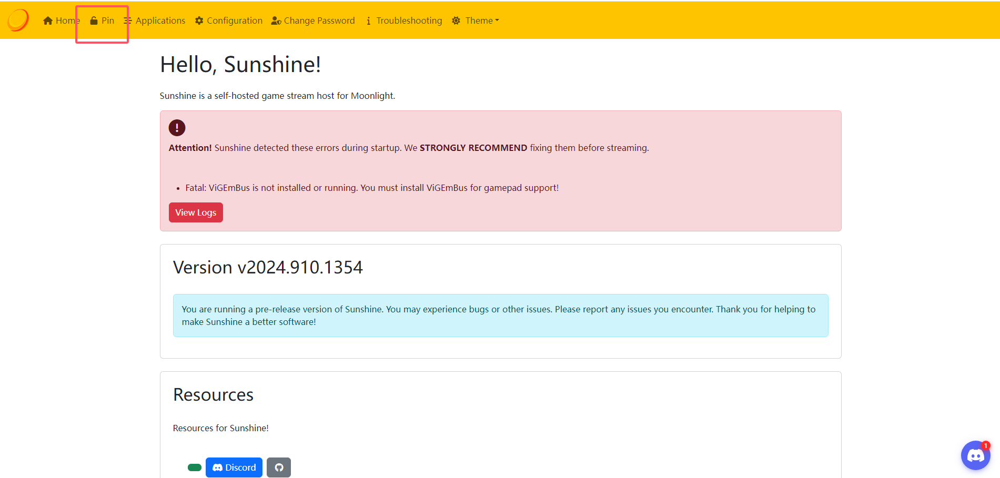  
输入此配对码，下面的device name可以随意填，比如123，点击send  
  
显示配对成功  
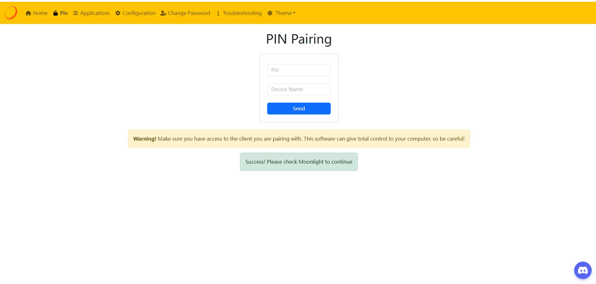  
在客户机moonlight中重新点击连接的主机  
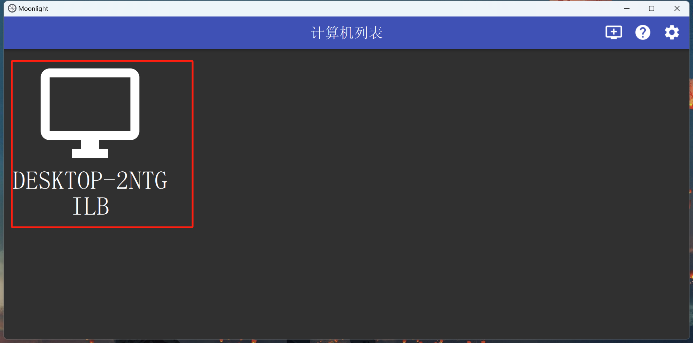  
再点击  
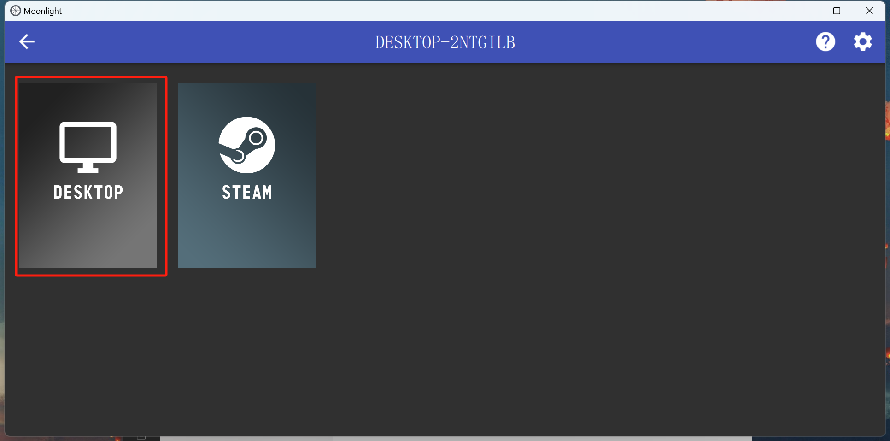  
然后自动连接，实现以下局域网投屏的效果  
  
**其他项**  
调节投屏的清晰度点击这里进行调节测试  
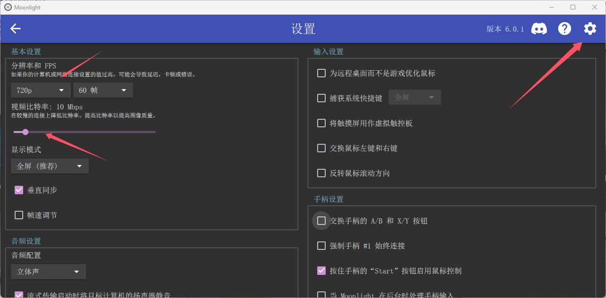

**加入扩展屏**  
在以下github官网链接，下载ParsecVDisplay

```
https://github.com/nomi-san/parsec-vdd/releases
```

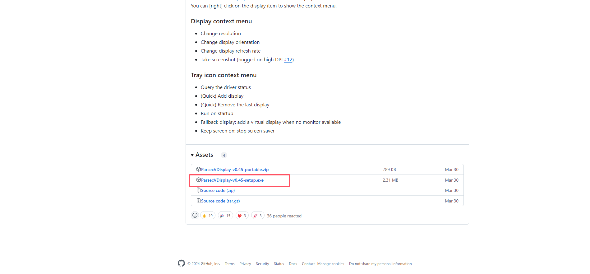  
下载完毕安装完成，点击这里设置虚拟屏幕分辨率和帧率  
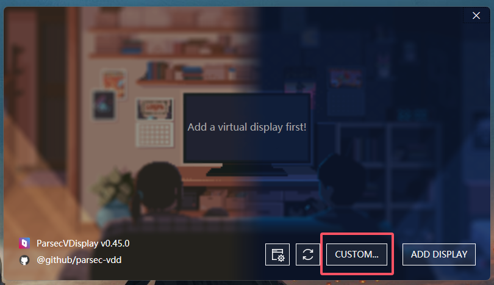  
这里设置一块2.5k/75hz的屏幕，点击apply应用配置  
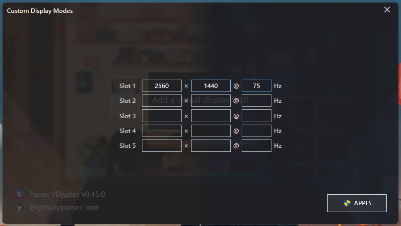  
点击add 增加这块屏幕  
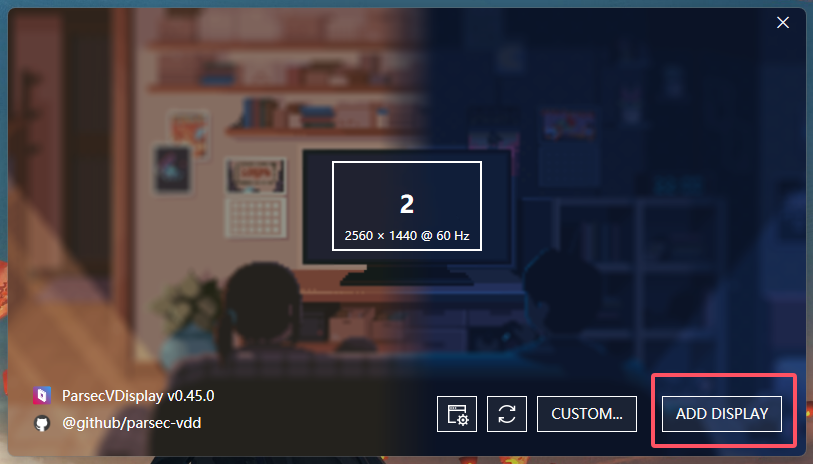  
在屏幕上右键，查看到如下信息  
  
在sunshine的配置界面中填入上述信息，然后save保存，重启sunshine  
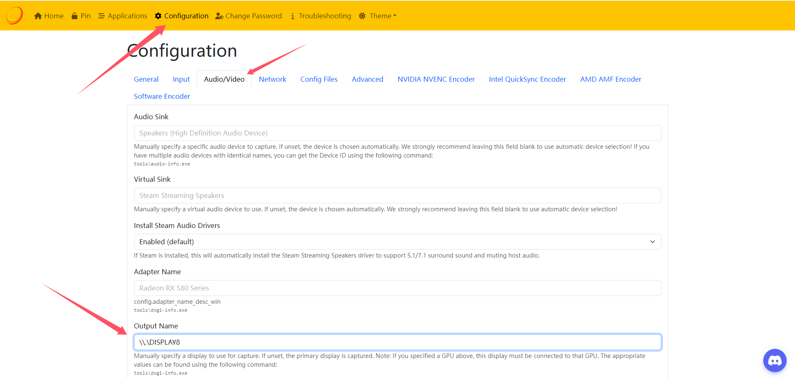  
sunshine默认用的是集显，在某些2K或者4K视频流推送场景下会带不起来，以下为更改独显工作流程。  
以下为官方教程链接设置gpu工作

```
https://support.parsec.app/hc/en-us/articles/4423615425293-VDD-Advanced-Configuration#parent_gpu
```

