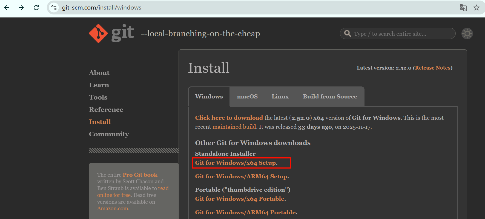
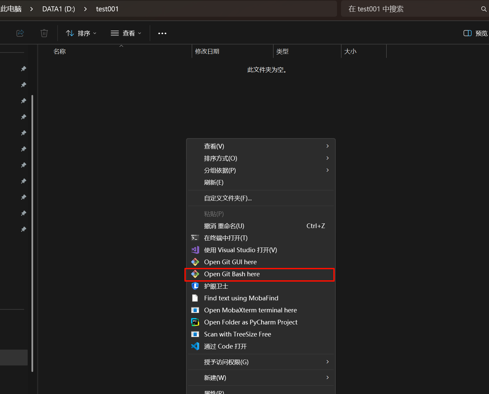
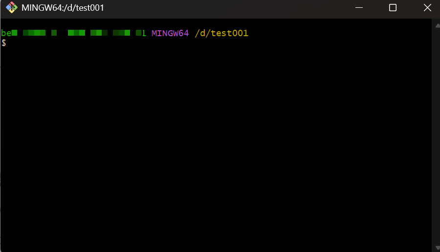
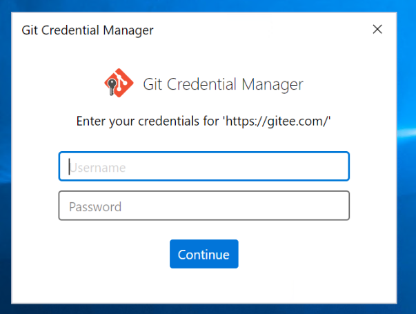
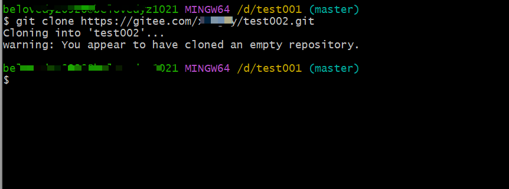
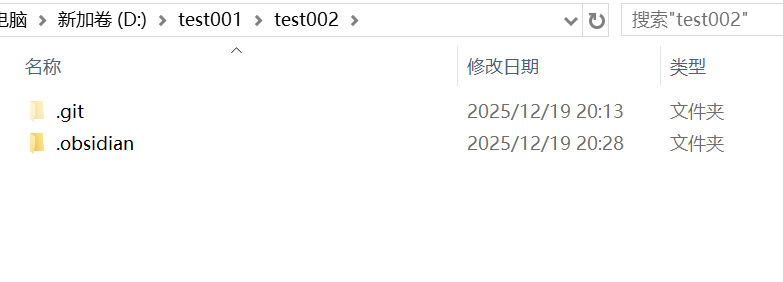
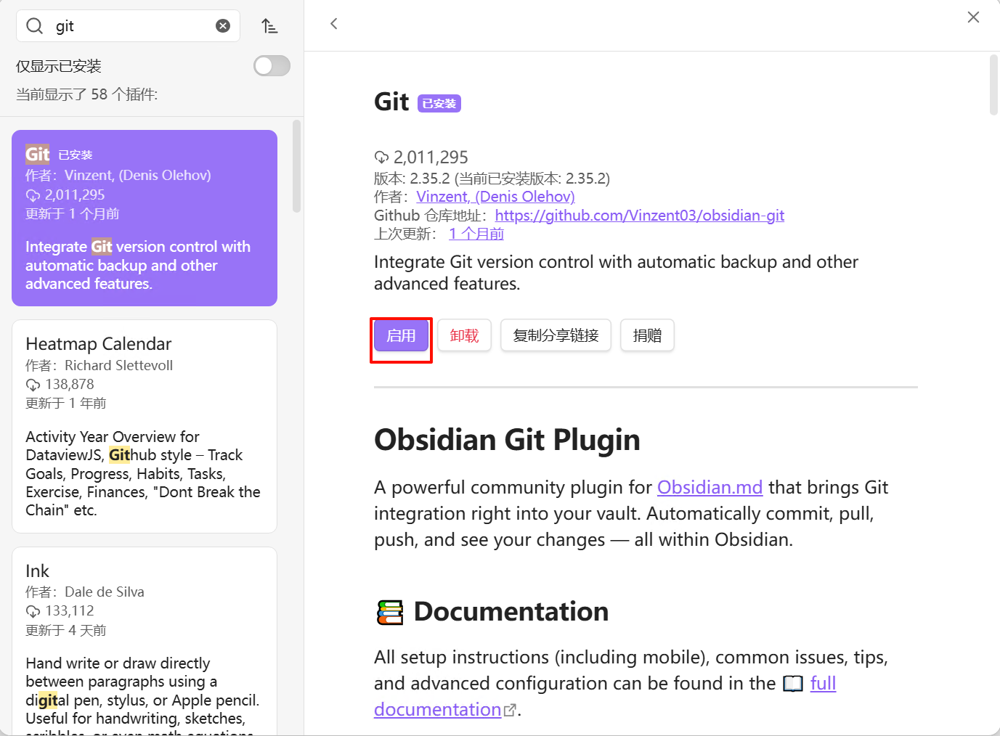
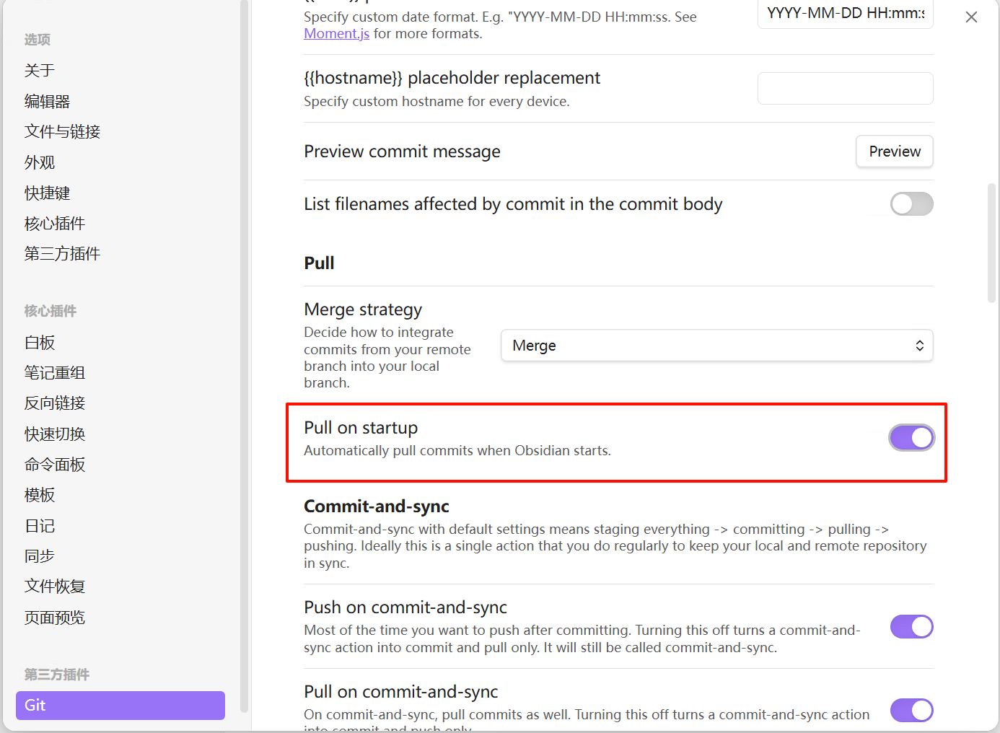

### 01-obsidian+gitee搭建云笔记

### 1、说明

| 软件名称      | 作用                                         |
| ------------- | -------------------------------------------- |
| git bash      | 初始化本地仓库，配置环境信息                 |
| obsidian+插件 | 构建“个人知识图谱”，可进行相互链接，同步到云 |
| typora        | 本地笔记编写，所见即所得                     |

### 2、搭建步骤

#### 2.1、gitee环境准备

创建一个或者是多个仓库，但是不需要初始化readme


创建后会默认弹出以下信息，选择HTTPS，保留1、2内容，**2.2**中使用


#### 2.2、git bash安装+初始化本地仓库

##### 2.2.1 下载

下载地址：https://git-scm.com/install/windows



##### 2.2.2 安装

管理员身份运行后，一直选择下一步安装即可，请注意，如果你不熟悉每个选项的意思，请保持默认的选项

##### 2.2.3 初始化本地仓库

新建文件夹作为本地笔记存储路径，建议非C盘，我这里是D:\test001，进入文件夹，右击选择==open git bash here==



打开后是



依次执行以下命令

```bash
#1、初始化本地git环境
git init
#2、配置local级别的用户信息，默认保存的是global的，去除global的关键词
git config  user.name "Neil"
git config user.email "9853578+xdxghy@user.noreply.gitee.com"
#3、把gitee仓库clone到本地
git clone https://gitee.com/xdxghy/test001.git
```


执行上述clone后，会自动弹出gitee的登录窗口，输入用户名密码登录即可



如图，表示拉取成功



#### 2.3、obsidian安装+插件安装配置

##### 2.3.1 下载

下载地址：https://obsidian.md/


##### 2.3.2 安装

管理员身份运行后，一直选择下一步安装即可，请注意，如果你不熟悉每个选项的意思，请保持默认的选项

##### 2.3.3 打开仓库

安装软件后，打开，则会提示如下，选择打开本地仓库，选择D:\test002\test002


此时在windows资源管理器打开这个目录，会发现在这个目录下多了一个**.obsidian**的目录，里边是obsidian的配置文件



在这个目录，需要新建一个文件.gitignore，写入以下信息，表示不把obsidian缓存区的文件同步到gitee

```bash
.obsidian/workspace.json
.obsidian/workspace-mobile.json
```

##### 2.3.4 插件安装

关闭安全模式，点击社区插件市场，点击浏览


输入git，检索（==这里加载比较慢，因为是获取的github的资源，后续考虑魔法或者是pkmer==）


安装好了启用



启用后配置选项




保存后，直接关闭窗口即可

##### 2.3.5 同步到gitee测试

在本地创建几个文件


关闭obsidian，再次开启，就可以看到自动同步了文件


打开gitee仓库查看，就可以看到上传的文件

#### 2.4、typora安装

下载地址：https://typoraio.cn/

管理员身份运行后，一直选择下一步安装即可，请注意，如果你不熟悉每个选项的意思，请保持默认的选项


注意，这里可以把笔记目录固定下，后续打开typora就是笔记目录

