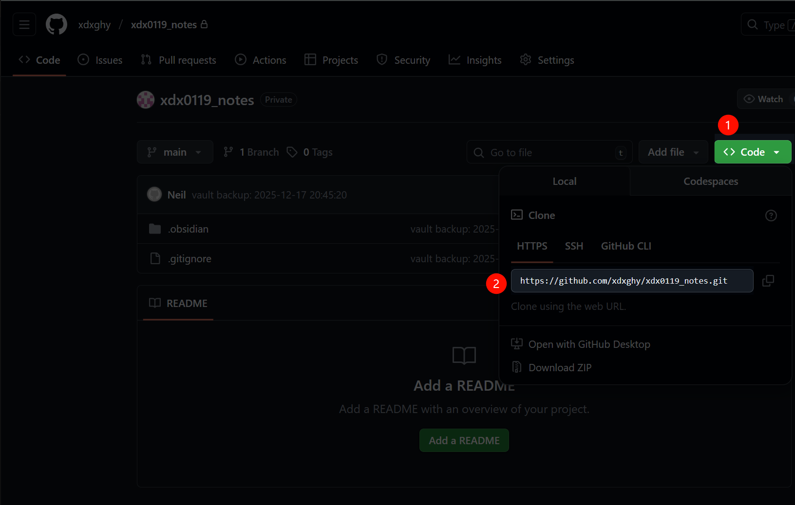
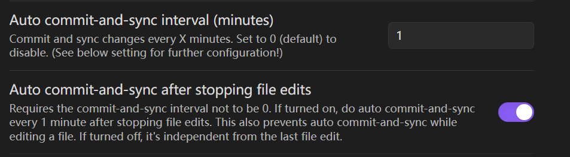
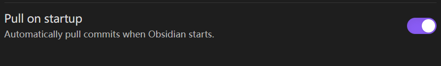

在微软商店下载watt toolkit，解决github打不开的问题


下载地址：[https://obsidian.md/download](https://obsidian.md/download)

1、安装watt toolkit，解决github打不开问题

2、安装obsidian，安装后先不要启动

3、安装git bash

4、在github创建一个仓库

5、在本地使用git bash进入对应的命令行

```git
#1、初始化
git init
#2、设置local用户名+email
#3、克隆仓库在本地
git clone https://github.com/xdxghy/xdx0119_notes.git
#执行完会让你登录github，登陆下就可以
```



6、打开obsidian，打开仓库，此时会生成.obsidian文件夹，里边是相关的配置信息


7、打开文件夹，到仓库，创建.gitignore，写入

```bash
.obsidian/workspace.json
.obsidian/workspace-mobile.json
```

不把当前客户端打开的信息上传

8、安装插件

关闭安全模式，在社区插件市场安装git+启动+设置


以下三个参考如何设置





9、此时就好了

每次打开obsidian，就会下载github的数据，保持最新

停止编辑1分钟后，就会自动上传


