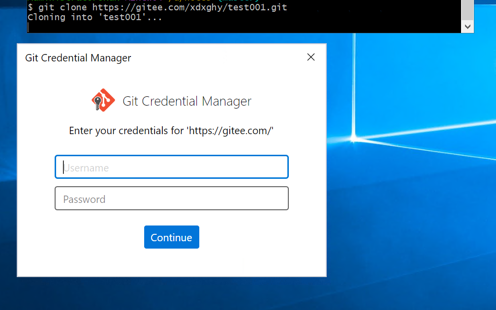
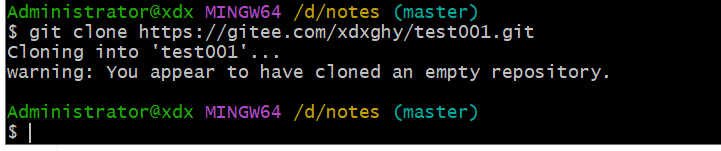

## 03-gitee+obsidian

### 1、设置远程仓库+拉取到本地

```git
git init
git config  user.name "Neil"
git config user.email "9853578+xdxghy@user.noreply.gitee.com"
git clone https://gitee.com/xdxghy/test001.git
```

执行拉去后，会弹出需要登录gitee的账号密码，输入即可





2、安装obsdian

安装插件+配置+测试
