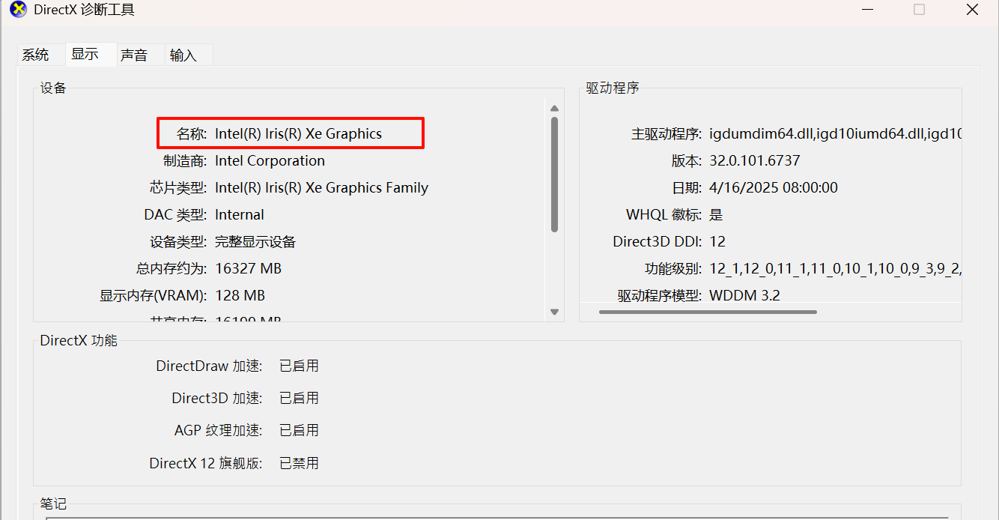
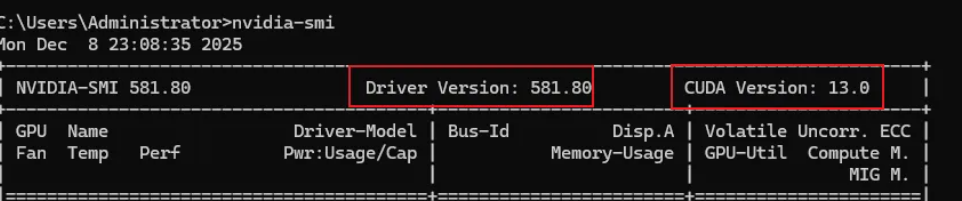
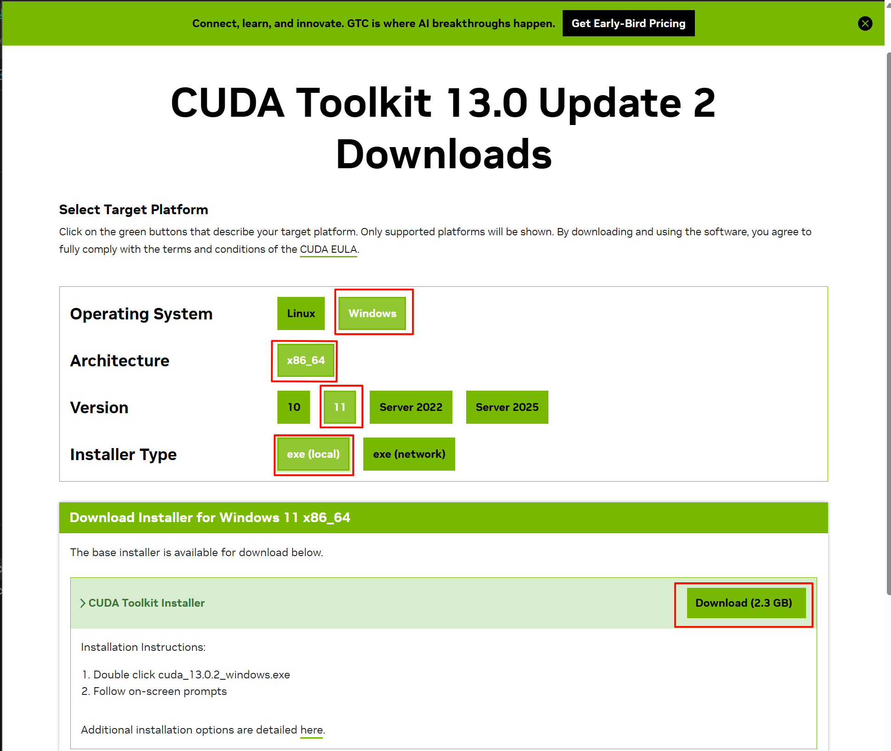

# 01-windows安装cuda

### 🧩 驱动和 CUDA 的关系

| 项目                     | 说明                                                         |
| ------------------------ | ------------------------------------------------------------ |
| **NVIDIA 驱动 (Driver)** | 必须先安装。它是操作系统与 GPU 之间的桥梁。`nvidia-smi` 就是这个驱动提供的工具。 |
| **CUDA Toolkit**         | 包含编译器（`nvcc`）、库文件、开发工具等，用于开发 CUDA 应用程序。它依赖于驱动。 |

## 1、安装驱动

### 1.1 检查是否安装驱动

```
nvidia-smi
```

如果是提示nvidia-smi' 不是内部或外部命令...，说明 **NVIDIA 驱动未正确安装** 或系统找不到该命令

### 1.2 查看显卡型号

==我这里是核显，无法安装==

#### 1.2.1 方法1

win+x，选择设备管理器，展开 **显示适配器（Display adapters）**。就会看到类似的内容，比如

- `NVIDIA GeForce RTX 3060`
- `Intel(R) UHD Graphics`
- `AMD Radeon RX 6700 XT`

#### 1.2.2 方式2

```
dxdiag
```

执行后点击「是」允许检查签名，切换到 **“显示”** 选项卡，在“设备”部分可以看到 **名称（Name）**，即你的显卡型号



#### 1.2.3 方式3

```
wmic path win32_VideoController get name
```

输出显示

```cmd
C:\Users\belovedyz0920>wmic path win32_VideoController get name
Name
OrayIddDriver Device
Intel(R) Iris(R) Xe Graphics
#这里说明电脑没有独立的显卡，不支持安装NVIDIA CUDA
```

### 1.3 安装驱动

在以下网址输入型号，点击查找

https://www.nvidia.cn/drivers/lookup/

比如


点击查找


#### 📌 如何选择？Game Ready vs Studio 驱动？

| 类型                | 推荐人群       | 特点                                                         |
| ------------------- | -------------- | ------------------------------------------------------------ |
| **Game Ready 驱动** | 游戏玩家       | 支持最新游戏首发日优化，补丁、DLC 兼容性好，更新频繁         |
| **Studio 驱动**     | 设计师、创作者 | 更稳定，适合视频剪辑、3D 渲染、AI 创作、Photoshop/After Effects 等专业软件 |

这里下载任何一个都可以，根据场景选择，点击查看就可以下载


### 1.4 确定cuda版本上限

**==驱动决定支持的 CUDA 版本上限==**

下载安装后重启电脑，然后在执行

```
nvidia-smi
```

比如



发现CUDA Version:13.0，也就是版本为13.0。

## 2、cuda安装

### 2.1、检查是否安装cuda

```cmd
nvcc -V
#没有回显表示没有安装
```

### 2.2 下载

打开https://developer.nvidia.com/cuda-toolkit-archive

查找需要的版本cuda，这里查出来是13.0，那么表示上限是13.0，可以找一个版本安装，比如12.8



### 2.2、安装

打开已下载的CUDA所在的文件夹，双击安装文件并开始安装，按照界面上的提示来安装程序。

如果出现**NVIDIA安装程序已完成**对话框，则表示CUDA安装成功。


### 2.3 查看版本

```cmd
C:\Users\belovedyz0920>nvcc -V
nvcc: NVIDIA (R) Cuda compiler driver
Copyright (c) 2005-2025 NVIDIA Corporation
Built on Wed_Aug_20_13:58:20_Pacific_Daylight_Time_2025
Cuda compilation tools, release 13.0, V13.0.88
Build cuda_13.0.r13.0/compiler.36424714_0
```

