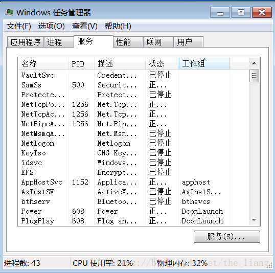
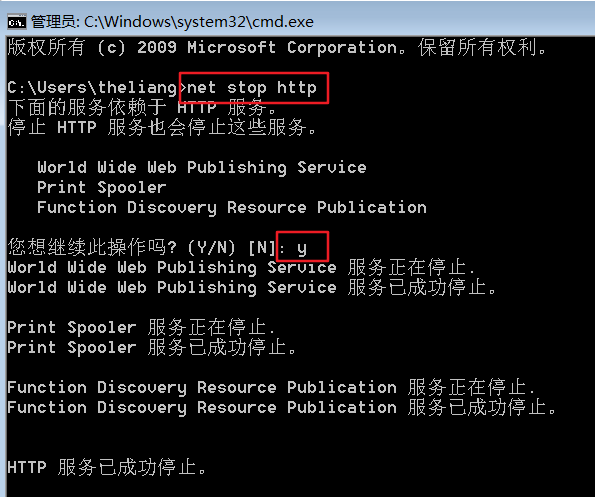

# 01-windows 80 systemd.md

参考：[解决windows系统80端口被占用问题 - Selier - 博客园](https://www.cnblogs.com/selier/p/9514426.html)

80端口被 system (pid=4) 系统占用的解决方法，80端口占用后服务器无法运行

80端口一般被当做网页服务器的默认端口，使用本机搭建服务器环境的时候，都会默认使用80端口来作为网页访问端，但是有的时候80端口会被其他的不明身份的程序占用，导致 Apache 启动失败，修改 Apache 的默认端口后访问本机地址又非常麻烦。下面介绍一下如果80端口被占用后应该如何处理。

## 1、查找80端口被谁占用的方法
进入命令提示行（开始运行输入 CMD），输入命令 `netstat -ano|findstr 80` (显示包含:80的网络连接) ，就可以看到本机所有端口的使用情况，一般80端口在第一行，截图显示，端口已经被占用，PID 中写明 LISTENING 4。

PID=4 的程序是哪一个呢？接着在命令提示和下输入指令 tasklist，列出所有当前运行的进程，发现 PID=4 的进程，居然是 system 。

扩展：也可以通过任务管理器查看PID：

## 2、取消 system 进程对80端口的占用
系统占用的端口一般都是微软官方的产品占用的。所以这个时候主要考虑到几个服务：

1. SQL Server导致。其中很有可能是SQL Server Reporting Services (MSSQLSERVER)，它是 SQL Server 的日志系统。
2. IIS 服务。如果你电脑安装了这个，很有可能它在运行着，那么它就占用着80端口

当然如果都不是这两个原因的话，可以使用下下面的解决方法

### 关闭方式1
关闭方法很简单，在运行框中输入`services.msc` ，进入服务窗口。或者直接在开始菜单里面的搜索框中输入“服务”即可打开。然后找到 **SQL Server Reporting Services (MSSQLSERVER)**这个服务，然后停止，被占用的80端口就被释放出来了。你也可以设置它的启动方式为“禁用”。

对于iis的服务也可以用此方法解决

### 关闭方式2(针对还是没办法解决的)
1. 使用管理员身份运行 cmd
2. `net stop http` //停止系统http服务
3. `sc config http start= disabled` //禁用服务的自动启动，此处注意等号后面的空格不可少

这个时候80端口就会被释放，你可以重启你的应用程序啦

