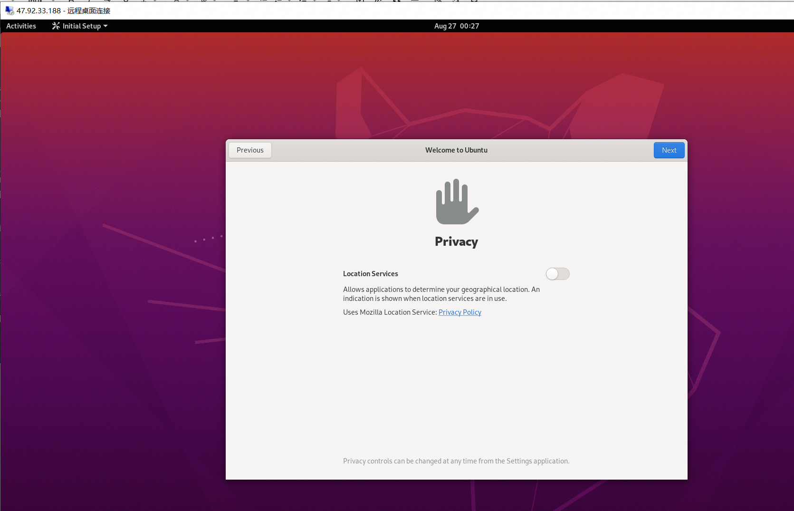

# 01-安装xrdp桌面

适用版本：20.04、22.04、24.04

[ubuntu 22.04 server 版本 安装桌面、安装XRDP_ubuntu安装xrdp-CSDN博客](https://blog.csdn.net/x191207160/article/details/132909280)

```bash
apt update -y
apt install ubuntu-desktop xrdp -y
systemctl enable --now xrdp
```

```bash
vim /root/.profile  

##在mesg 前面加上   tty -s &&
tty -s && mesg n 2> /dev/null || true

source /root/.profile  
```

```bash
关于root的限制登录选项注释掉

vim /etc/pam.d/gdm-autologin 
#auth   required        pam_succeed_if.so user != root quiet_success

vim /etc/pam.d/gdm-password
#auth   required        pam_succeed_if.so user != root quiet_success
```

```bash
reboot
```



