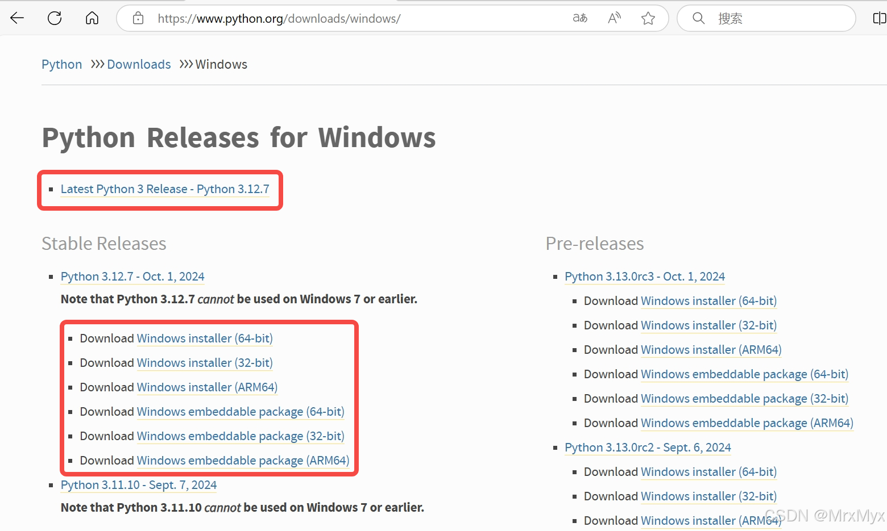
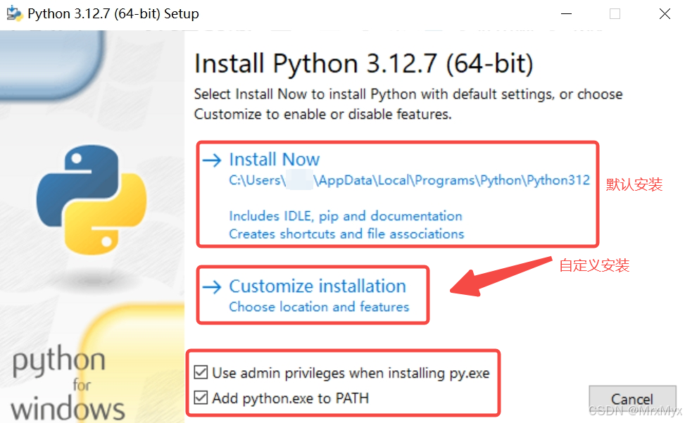
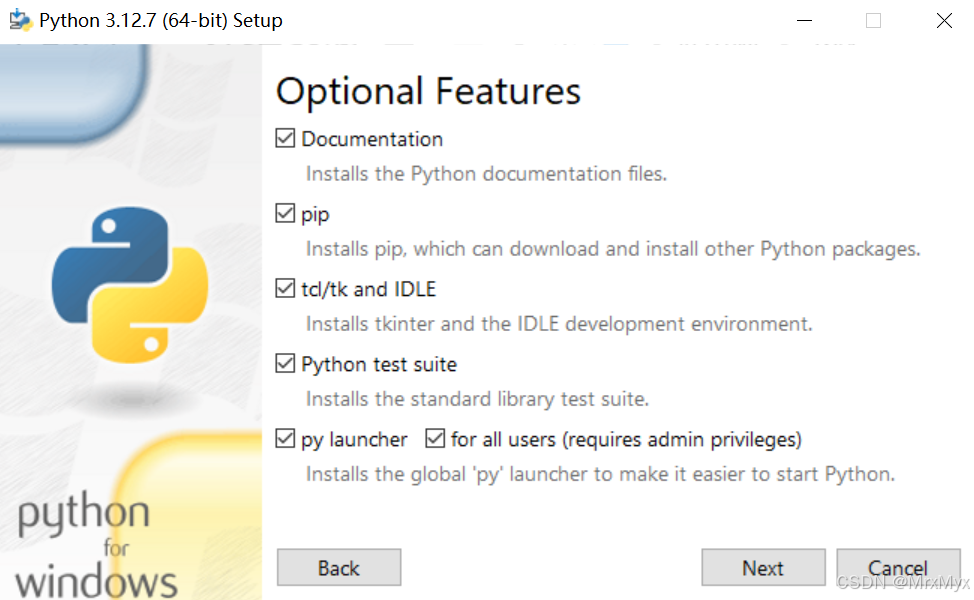
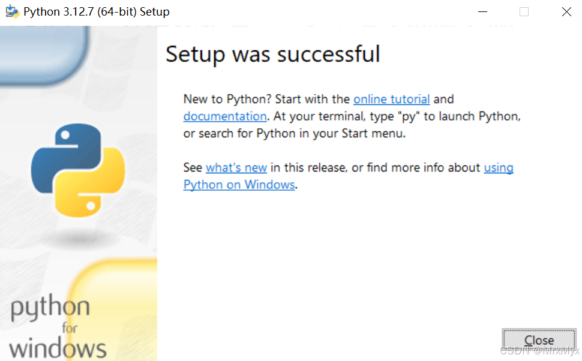
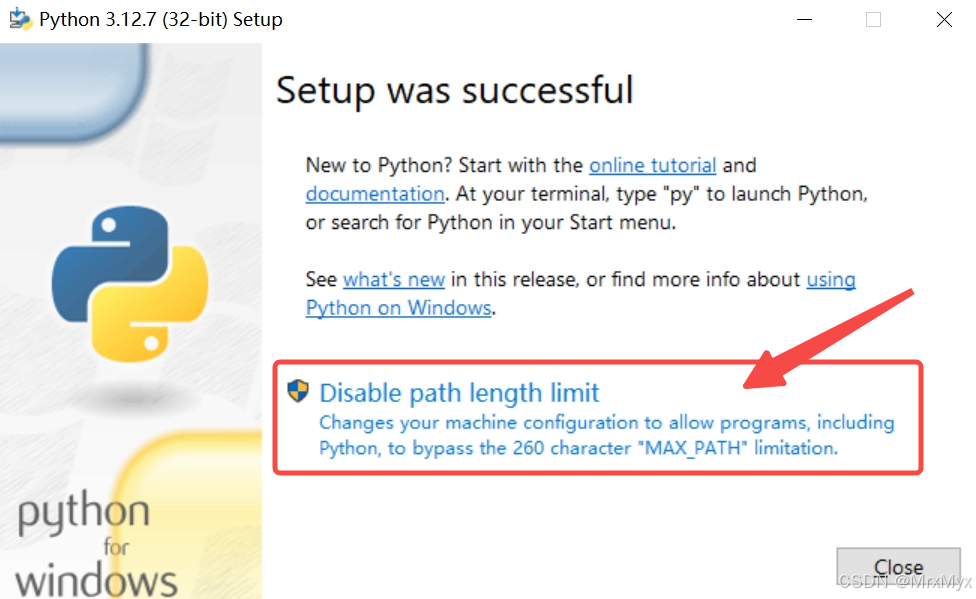
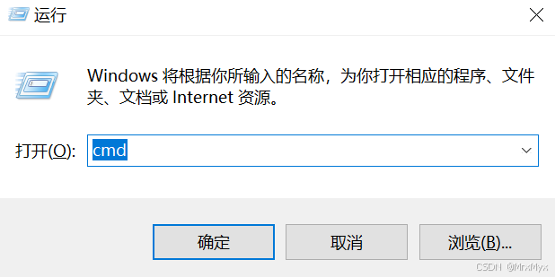
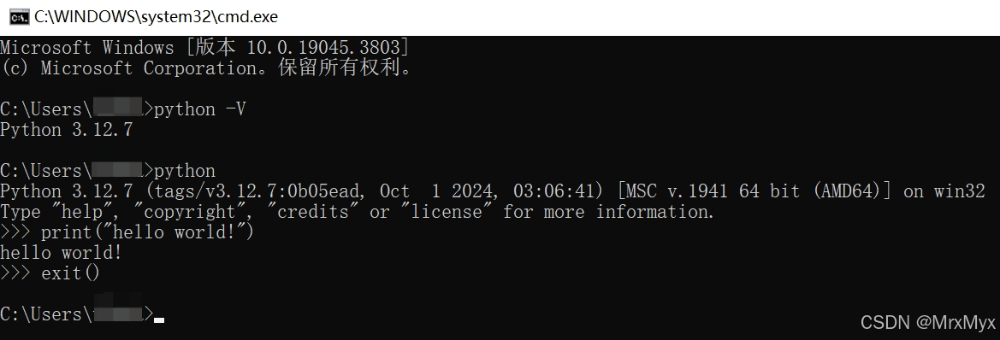
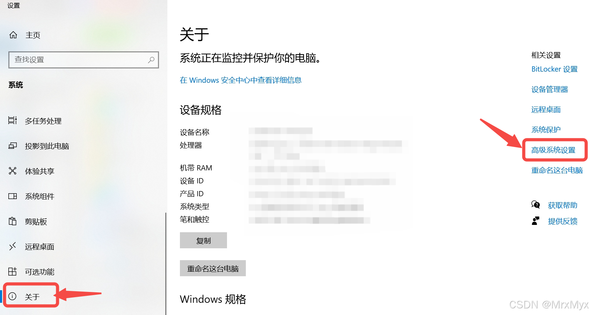
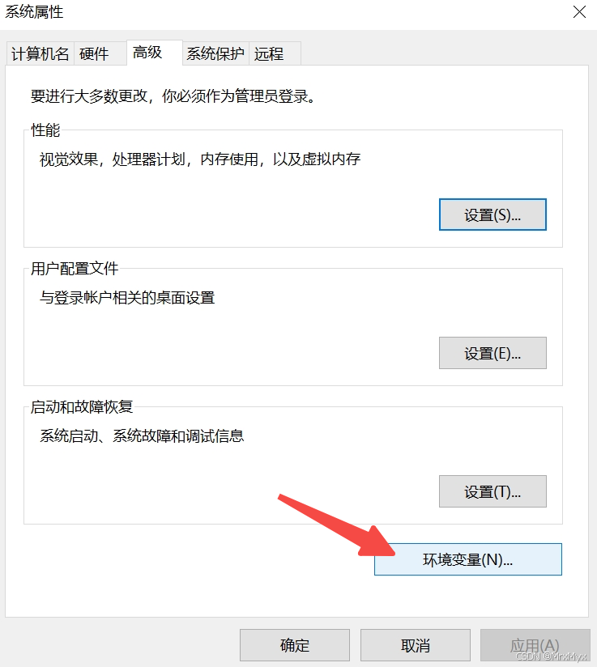
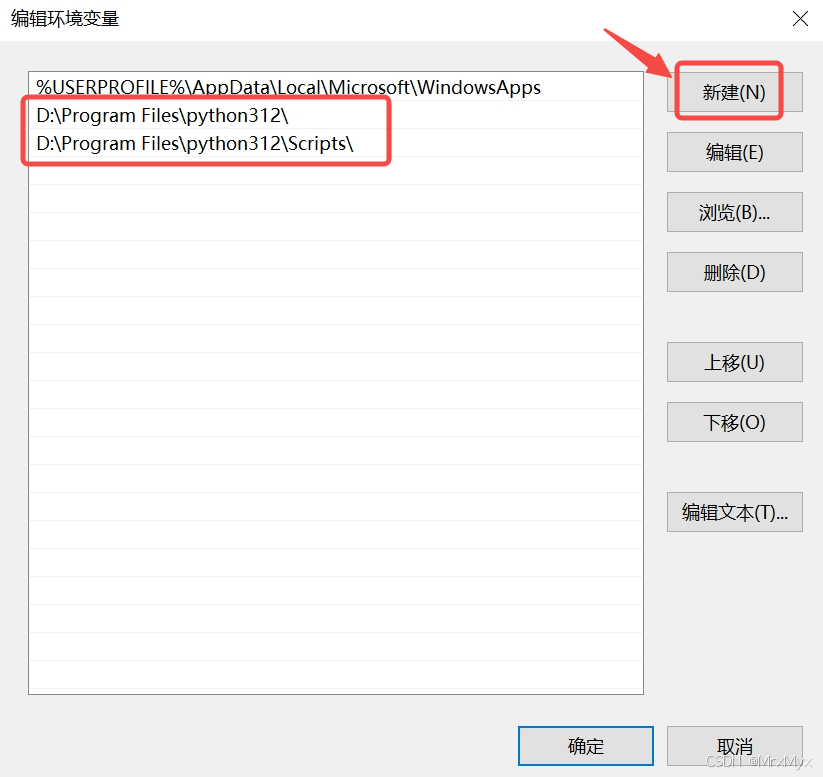

# 01-Windows下的python安装教程

参考：https://blog.csdn.net/Vista7Malone/article/details/142700271?ops_request_misc=&request_id=&biz_id=102&utm_term=windows%20python&utm_medium=distribute.pc_search_result.none-task-blog-2~all~sobaiduweb~default-1-142700271.142^v102^pc_search_result_base7&spm=1018.2226.3001.4187

前言
--

Python 是一种广泛使用的高级[编程语言](https://so.csdn.net/so/search?q=%E7%BC%96%E7%A8%8B%E8%AF%AD%E8%A8%80&spm=1001.2101.3001.7020)，以其简洁易读的语法和强大的库支持而著称。无论你是初学者还是经验丰富的开发者，安装 Python 都是开始编程旅程的第一步。以下是详细的 Python 安装教程（以Windows的64bit版本python安装为例）。

* * *

一、下载python
----------

进入python官网[https://www.python.org/getit/](https://www.python.org/getit/)或[https://www.python.org/downloads/](https://www.python.org/downloads/)下载python安装包，选择适合你操作系统的版本（建议选择最新的稳定版本）。下载过程如下：  
进入官网后，可以直接点击Download Python 3.xx.x下载最新的Windows版的python安装包： 
  
或者点击上图的Windows进入详细页，可以选择更多的版本，比如有64bit、32bit、嵌入式版本等，点击即可下载：  

二、安装python
----------

Windows版本的python安装包是一个exe文件，下载完成后，打开运行即可：  
  
在下面的安装界面中，首先建议把“Use admin privileges when installing py.exe”勾选上，可以使用管理员权限进行安装。  
然后一定记得勾选“Add python.exe to PATH”，可以自动配置好python的环境变量。（如果安装时忘记勾选了也没关系，可以参照第四章节进行手动配置）  
然后可以选择“Install Now”直接进行默认安装，默认的安装路径一般为C盘用户的AppData路径下，或者选择“Customize installation”进行自定义安装：  
  
上图以选择“Customize installation”进行自定义安装为例，然后在“Optional Features”页中默认全选安装所有选项：  
  
然后在“Advanced Options”页中自定义安装路径，再点击Install进行安装即可：  
  
安装预计持续1分钟左右，请耐心等待：  
  
完成安装后会出现如下界面，显示“Setup was successful”：  
  
如果安装完成后，显示了如下的“Disable path length limit”提示，这是由于路径长度默认有不能超过260字符的限制，点击禁止此限制即可：  

三、验证环境
------

按下“Win + R”键并输入“cmd”来打开命令提示符窗口：  
  
在命令提示符窗口输入“python -V”可以查看python的版本（注意-V是大写），或者直接输入python可以进入python命令行模式，可以进行简单的测试，然后输入“exit()”退出python命令行模式：  
  
至此，python已经安装成功。  
但是，如果你输入了上述命令，却提示“python不是内部或外部命令,也不是可运行的程序或批处理文件”，那么可能是你在之前的安装选项中没有勾选“Add python.exe to PATH”，没有自动将python的相关可执行程序路径添加到环境变量中。没关系，继续参照下一章节，手动添加环境变量。

四、配置环境变量（可选）
------------

进入windows设置 -> 选择系统：  
  
左侧选择“关于”，然后点击进入“高级系统设置”：  
  
在系统属性的“高级”页面中，点击“环境变量”：  
  
在环境变量页的用户变量或系统变量中，双击“Path”：  
  
以双击用户变量中的Path为例，在弹出的编辑环境变量窗口中，新建python的安装路径，包括python.exe所在路径（如D:\\Program Files\\python312）和pip.exe所在路径（如D:\\Program Files\\python312\\Scripts）：  
  
点击“确定”，保存设置即可。  
补充完成了环境变量设置后，可以参照第三章节，验证是否配置成功。