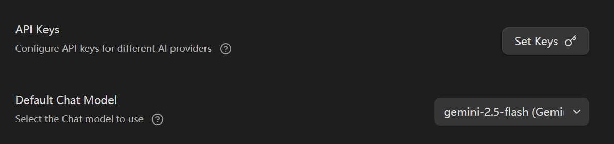
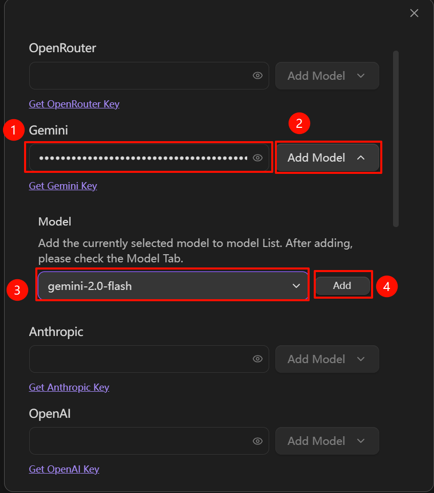
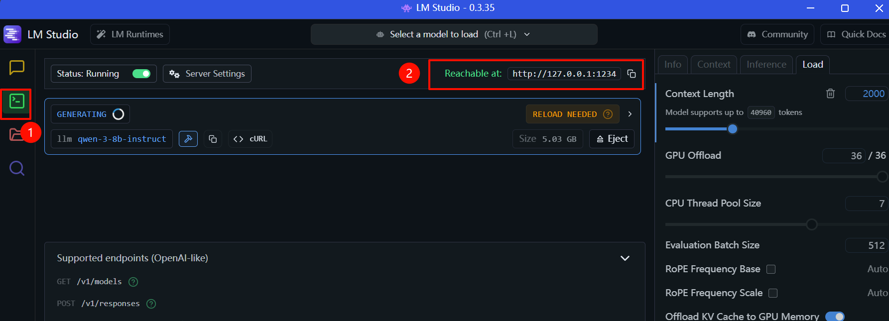
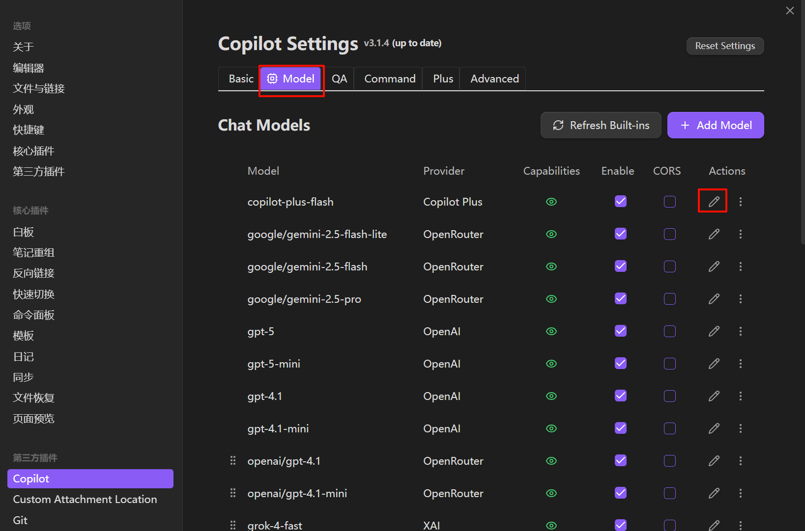

## 1、obsdian+gemini（API key）

1、获取api-key

https://makersuite.google.com/app/apikey

2、在obsidian种安装**copilot**插件

3、配置api-key到copilot

设置api keys+把默认模型改为设置的模型

## 2、obsidian+LM studio+qwen

LM studio+qwen部署

1、开发者查看到api地址

http://127.0.0.1:1234

2、配置
插入视频[02-typora插入相对路径视频视频](../../02-windows软件安装/07-typora/02-typora插入相对路径视频视频.md)

<video id="video" controls=""src="video/obsidian设置对接LM studio+qwen.mp4" preload="none">

注意，在obsidian插件中配置的上下文长度要小于在LM studio中配置的，后续在这里修改

