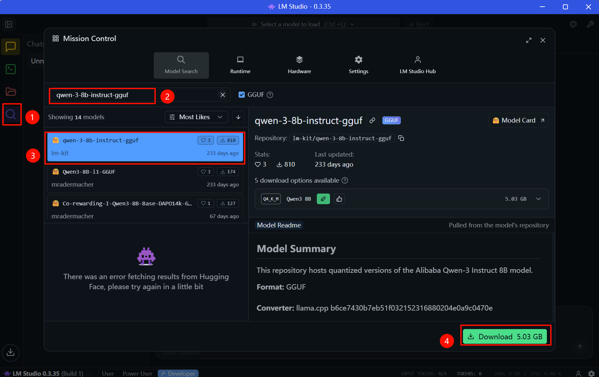
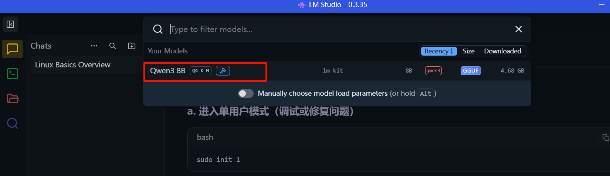
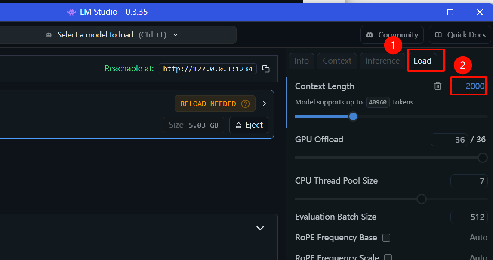

### 02-本地部署大模型-LM Studio

1、下载安装windows版本

https://lmstudio.ai/

https://installers.lmstudio.ai/win32/x64/0.3.35-1/LM-Studio-0.3.35-1-x64.exe

2、打开LM，搜索qwen-3-8b-instruct-gguf

3、下载完成后，在中间上方下拉选择qwen

4、打开开发者模式，状态改为运行中+打开server settings种的CORS开关

如果电脑配置比较低，可以在load把上下文的长度降低

